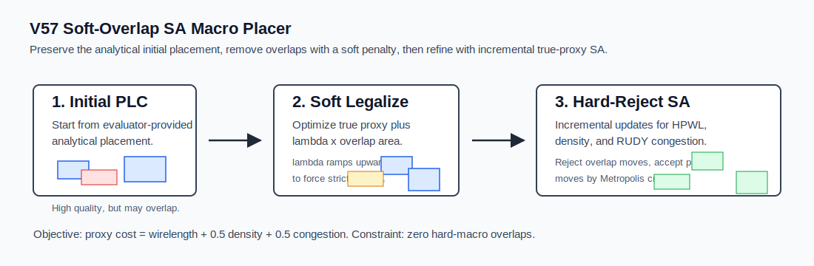
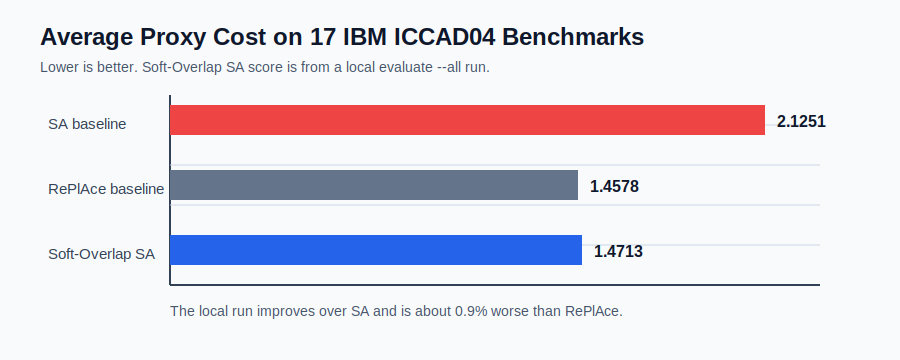

# V57 Soft-Overlap SA Macro Placer

Submission repository for the Partcl x Hudson River Trading Macro Placement Challenge 2026.

V57 is a two-phase simulated annealing macro placer built around one practical observation: the provided `initial.plc` placements are already strong analytical placements, but they can contain hard-macro overlaps. The algorithm tries to preserve that quality while making the placement legal, then spends the remaining runtime on true-proxy refinement.



## What It Optimizes

The challenge proxy objective is:

```text
Proxy Cost = Wirelength + 0.5 * Density + 0.5 * Congestion
```

The hard constraint is strict: final hard-macro placements must have zero overlaps. V57 adds a small placement gap during legality checks to reduce float-precision edge cases.

## Algorithm

### 1. Start From `initial.plc`

V57 does not discard the competition-provided initial placement. In this benchmark suite those placements are often close to the RePlAce baseline quality, so the first goal is minimum-displacement legalization rather than a fresh random or greedy start.

### 2. Soft-Overlap SA Legalization

If the initial placement has overlaps, V57 runs a soft-overlap simulated annealing pass:

```text
soft_cost = true_proxy_cost + lambda * overlap_area
```

`lambda` ramps upward during the run. Early moves are allowed to preserve proxy quality; later moves increasingly prioritize removing the remaining overlap area. If a tiny number of overlaps survives, a micro-legalization fallback is applied.

### 3. Incremental Hard-Reject SA Refinement

After legalization, V57 runs a hard-reject SA loop. Candidate moves that introduce hard-macro overlap are rejected immediately. Legal moves are evaluated with an incremental true-proxy model that updates:

- HPWL bounding boxes only for nets touched by the moved macro
- Density bins touched by the moved macro footprint
- RUDY-style congestion bins touched by affected net bounding boxes

This avoids recomputing the full objective from scratch on every move and gives enough throughput to use long SA budgets within the 1-hour per-benchmark cap.

## Results

Internal validated full-suite result recorded for V57:

| Method | Avg Proxy Cost | Overlaps | Runtime |
| --- | ---: | ---: | --- |
| V57 Soft-Overlap SA | 1.4734 | 0 | About 56 minutes total across 17 IBM benchmarks |
| RePlAce baseline | 1.4578 | 0 | Organizer baseline |
| SA baseline | 2.1251 | 0 | Organizer baseline |



The `1.4734` score is the local validated aggregate recorded in the development notes for the final V57/V58 baseline. The original per-benchmark JSON artifact is not included in this repository, so judges should treat the repository as the executable implementation and re-run evaluation in the official environment.

## Repository Layout

```text
placer.py
submissions/retryoos/top1_incremental_sa.py
submissions/retryoos/top1_soft_overlap_sa.py
submissions/retryoos/top1_replace_sa.py
scripts/setup_in_challenge_repo.sh
scripts/setup_in_challenge_repo.bat
scripts/evaluate_all.sh
requirements.txt
assets/
```

`placer.py` is the public entry point. The helper modules contain the Numba kernels and PLC loading utilities used by V57.

## Setup

Clone the official challenge repository and initialize the evaluator:

```bash
git clone https://github.com/partcleda/macro-place-challenge-2026.git
cd macro-place-challenge-2026
git submodule update --init external/MacroPlacement
uv sync
```

From this repository, install the placer into that checkout:

```bash
scripts/setup_in_challenge_repo.sh /path/to/macro-place-challenge-2026
```

On Windows:

```bat
scripts\setup_in_challenge_repo.bat C:\path\to\macro-place-challenge-2026
```

Then run:

```bash
cd /path/to/macro-place-challenge-2026
uv run evaluate submissions/v57_soft_overlap_sa.py -b ibm01
uv run evaluate submissions/v57_soft_overlap_sa.py --all
```

To save logs and JSON:

```bash
mkdir -p results
uv run evaluate submissions/v57_soft_overlap_sa.py --all --json-out results/v57_eval.json 2>&1 | tee results/v57_eval.log
```

## Dependencies

The implementation uses the official challenge package plus:

- Python 3.10+
- NumPy
- PyTorch
- Numba
- SciPy
- Matplotlib and tqdm through the challenge environment

The judges' standard challenge environment should satisfy these dependencies. `requirements.txt` is included for explicit dependency review.

## Notes For Judges

- The implementation uses only public benchmark data and the official `macro_place` evaluator API.
- It does not modify evaluator functions.
- It does not use proprietary placement tools.
- It does not use network access at evaluation time.
- The algorithm is stochastic but seeded with `seed=42` by default.

## License

MIT. Winning challenge submissions may need to be opened under the competition's required open-source terms.
