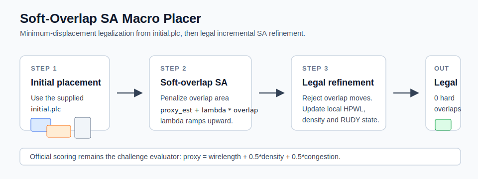

# Soft-Overlap Simulated Annealing Macro Placer

Submission repository for the Partcl x Hudson River Trading Macro Placement Challenge 2026.

This placer is a two-stage simulated annealing method for the Tier-1 IBM macro-placement proxy objective. It starts from the competition-provided `initial.plc`, legalizes hard-macro overlaps while preserving the structure of the initial placement as much as possible, and then refines the legal placement with an incremental proxy model.



## Objective

The official Tier-1 proxy objective is:

```text
Proxy Cost = Wirelength + 0.5 * Density + 0.5 * Congestion
```

The final placement must have zero hard-macro overlaps. The implementation uses a small legality gap when checking candidate moves to reduce float-precision edge cases.

## Algorithm

### 1. Preserve The Initial Placement

The algorithm starts from the supplied `initial.plc` placement rather than a random layout because those coordinates often contain useful global structure. The first phase therefore focuses on legalizing the placement with as little movement as practical.

### 2. Soft-Overlap Legalization

If the initial placement contains hard-macro overlaps, the placer runs a soft-overlap simulated annealing pass:

```text
soft_cost = incremental_proxy_estimate + lambda * overlap_area
```

`lambda` increases over the run. Early moves can trade a small amount of overlap for lower proxy cost; later moves increasingly prioritize eliminating overlap. If any overlap remains after this phase, the placer applies a final legalization pass before refinement.

### 3. Incremental SA Refinement

After legalization, candidate moves that would create a hard-macro overlap are rejected immediately. Legal moves are scored with an incremental proxy estimator that updates only local state affected by the moved macro:

- HPWL bounding boxes for touched nets
- Density bins touched by the macro footprint
- RUDY-style congestion bins touched by affected net bounding boxes

The incremental proxy estimator is used only to accelerate local search inside the annealing loop. Final scores are always computed with the official challenge evaluator.

## Results

Development aggregate recorded for this implementation:

| Method | Avg Proxy Cost | Overlaps | Runtime |
| --- | ---: | ---: | --- |
| Soft-Overlap SA placer | 1.4734 | 0 | ~56 minutes total runtime across the 17 IBM benchmarks on the local development environment |
| RePlAce baseline | 1.4578 | 0 | Organizer baseline |
| SA baseline | 2.1251 | 0 | Organizer baseline |


The `1.4734` figure is a local development result and has not been organizer-verified.

## Repository Layout

```text
placer.py                                  # submission entry point
submissions/retryoos/top1_incremental_sa.py # incremental SA kernels
submissions/retryoos/top1_soft_overlap_sa.py # soft-overlap legalization
submissions/retryoos/top1_replace_sa.py      # PlacementCost loading helper
scripts/setup_in_challenge_repo.sh           # install into official repo
scripts/setup_in_challenge_repo.bat
scripts/evaluate_all.sh
scripts/generate_artifacts.py
requirements.txt
assets/
artifacts/
```

`placer.py` is the file to install into the official challenge checkout. The helper modules contain the Numba kernels and evaluator-loading utilities used by the placer.

## Setup

Clone and initialize the official challenge repository:

```bash
git clone https://github.com/partcleda/macro-place-challenge-2026.git
cd macro-place-challenge-2026
git submodule update --init external/MacroPlacement
uv sync
```

From this repository, install the placer into that checkout:

```bash
scripts/setup_in_challenge_repo.sh /path/to/macro-place-challenge-2026
```

On Windows:

```bat
scripts\setup_in_challenge_repo.bat C:\path\to\macro-place-challenge-2026
```

Then run:

```bash
cd /path/to/macro-place-challenge-2026
uv run evaluate submissions/soft_overlap_sa_macro_placer.py -b ibm01
uv run evaluate submissions/soft_overlap_sa_macro_placer.py --all
```

To save logs and JSON:

```bash
mkdir -p results
uv run evaluate submissions/soft_overlap_sa_macro_placer.py --all \
  --json-out results/soft_overlap_sa_eval.json 2>&1 | tee results/soft_overlap_sa_eval.log
```

## Reproducible Artifacts

The repository includes a small artifact generator. The default mode creates comparison charts from the published challenge baselines and the recorded development aggregate:

```bash
python scripts/generate_artifacts.py
```

When pointed at a full challenge checkout, it can also render actual benchmark geometry:

```bash
python scripts/generate_artifacts.py \
  --challenge-repo /path/to/macro-place-challenge-2026 \
  --benchmark ibm01
```

To run the placer on that benchmark and emit final-placement PNGs plus an animated GIF from `initial.plc` to the final output:

```bash
python scripts/generate_artifacts.py \
  --challenge-repo /path/to/macro-place-challenge-2026 \
  --benchmark ibm01 \
  --run-placer
```

If `--run-placer` is not used, the script only produces static comparison artifacts and the initial placement.

## Dependencies

The implementation uses the official challenge package plus:

- Python 3.10+
- NumPy
- PyTorch
- Numba
- SciPy
- Matplotlib, Pillow, and tqdm for optional artifact generation

`requirements.txt` is included for explicit dependency review.

## License

Apache 2.0

## Authors

- Dimitris Kalligaridis - [LinkedIn](https://www.linkedin.com/dimitrios-kalligaridis/)
- Apostolos Kakarantzas - [LinkedIn](https://www.linkedin.com/in/akakarantzas/)
